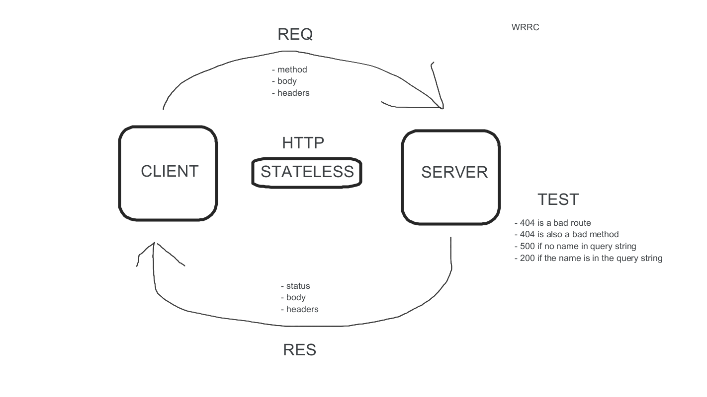

# LAB - Class 02

## Author: Jason Taisey

## Links and Resources
- [CI/CD](https://github.com/JTaisey389/basic-express-server.md/runs/2396848925?check_suite_focus=true)

- [Heroku Person](https://basic-express-server-new.herokuapp.com/person?name=jason)

- [Heroku Hello](https://basic-express-server-new.herokuapp.com/hello)
## Setup

- PORT=3000

## How to initialize/run your application (where applicable)
- npm run start

## Test
- 404 is for the bad routes
- 404 is for the bad method
- 500 for a no name in the query string
- 200 if the name is in the string query

## UML/Application

